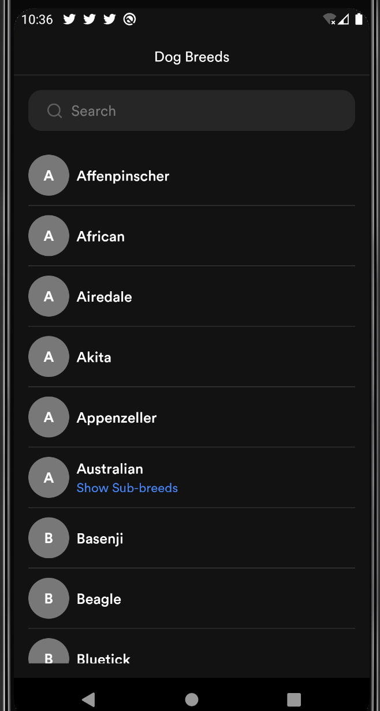
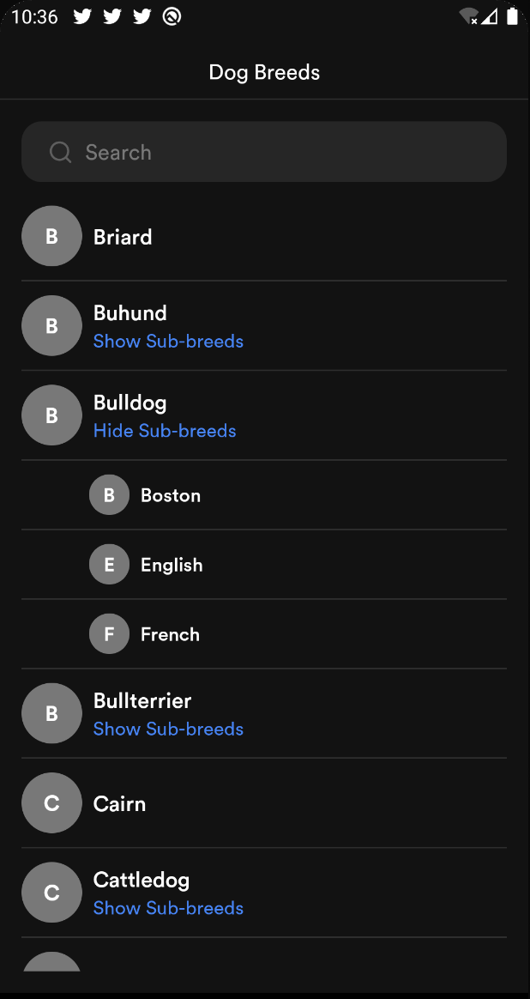
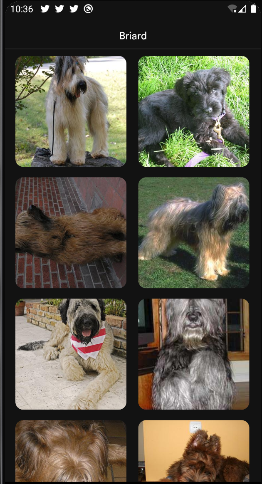

# Dog Ceo

An Android application to showcase Dog Breeds. The application allows users to see
various dog breeds/sub-breeds and view the images of each breed/sub-breed. The application consumes
data from the [Dog Ceo API](https://dog.ceo/api/)

Minimum Api Level : 22

compileSdkVersion : 30

Build System : [Gradle](https://gradle.org/)

## Table of Contents

- [Architecture](#architecture)
- [Libraries](#libraries)
- [Solution](#solution)
- [Testing](#testing)
- [Organisation](#organisation)
- [Demo](#demo)


## Architecture

The application is built with scalability in mind and care for having multiple developers working
on it. I used the Clean architectural principles to build the application.
I choose this architecture because it fosters better separation of concerns
and testability.

The Application is split into a three layer architecture:

- Data
- Domain
- Presentation


#### Data

The data layer handles the business logic and provides data from the
Dog Ceo API. This layer uses the Repository pattern to fetch data from the data source which in
this case is the Dog Ceo API.


#### Domain

The domain layer contains the application specifics logic. It contains
interactors/use cases that expose the actions that can be performed in the application.

The UseCases use a ```BaseUseCase``` interface that defines the parameters its taking in and
output and also handles running the UseCases in a background thread leveraging Kotlin Coroutines.


#### Presentation

I used the MVVM pattern for the presentation layer. The Model essentially exposes
the various states the view can be in. The ViewModel handles the UI logic and provides
data via Android architectural component LiveData to the view. The ViewModel talks to
the domain layer with the individual use cases.


## Libraries

Libraries used in the application are:

- [Jetpack](https://developer.android.com/jetpack)
  - [Viewmodel](https://developer.android.com/topic/libraries/architecture/viewmodel) - Manage UI related data in a lifecycle conscious way
  and act as a channel between use cases and UI.
  - [Data Binding](https://developer.android.com/topic/libraries/data-binding) - support library that allows binding of UI components in layouts to data sources.
  - [LiveData](https://developer.android.com/topic/libraries/architecture/livedata) - Provides an observable data holder class.
- [Retrofit](https://square.github.io/retrofit/) - type safe http client and supports coroutines out of the box.
- [Shimmer](https://facebook.github.io/shimmer-android/) - Shimmer provides an easy way to add a shimmer effect to views in the application.
- [Moshi](https://github.com/square/moshi) - JSON Parser, used to parse requests on the data layer for Entities and understands Kotlin non-nullable
and default parameters.
- [okhttp-logging-interceptor](https://github.com/square/okhttp/blob/master/okhttp-logging-interceptor/README.md) - logs HTTP request and response data.
- [kotlinx.coroutines](https://github.com/Kotlin/kotlinx.coroutines) - Library Support for coroutines. I used this for asynchronous programming in order
to obtain data from the network.
- [JUnit](https://junit.org/junit4/) - This was used for unit testing the repository, the use cases and the ViewModels.
- [Mockk](https://mockk.io/) This is a mocking library for Kotlin. I used it to provide test doubles during testing.
- [Truth](https://truth.dev/) - Assertions Library, provides readability as far as assertions are concerned.
- [Hilt](https://dagger.dev/hilt/) - Dependency injection plays a central role in the architectural pattern used.
- [Robolectric](http://robolectric.org/) - Unit test on android framework.
- [Espresso](https://developer.android.com/training/testing/espresso) - Used for writing Android UI tests.
- [Ktlint](https://github.com/pinterest/ktlint) - A Kotlin linter with built-in formatter.

## Solution

I decided to use the single Activity with multiple fragments approach.
Once the activity is fired up, the ```DogBreedFragment``` is added to the backstack.
The ```DogBreedFragment``` is responsible for showing the list of dog breed.
The fragment reaches out to the ```DogBreedViewModel``` to fetch dog breeds. The ViewModel delegates to the ```GetDogBreedsUseCase``` which is responsible for fetching
dog breeds. The ```GetDogBreedsUseCase``` via a repository interface requests this data from the data layer.
The data layer retrieves the data from the API. The user can search for dog breeds via a search input field on this screen.
As the user types, the fragment reaches out to the ViewModel to obtain the dog breeds that match the
input string.
Furthermore, clicking on any dog breed/sub-breed in the list triggers the ```DogBreedImageFragment```.
The breed name/sub-breed name are passed to the ```DogBreedImageFragment```. This screen reaches out to the ```DogBreedImagesViewModel```
to retrieve the images of the breed/sub-breed.

In general, any particular flow can be said to follow the steps below:
- The view sends an action to the ViewModel
- The ViewModel reaches out to the UseCase/Interactor
- The UseCase via an abstraction layer reaches out to the repository
- The repository retrieves the data and returns (mapped to domain representation) result via a Sealed ```Result``` class.
- The UseCase gets the returned value and hand it over to the ViewModel
- The ViewModel maps the returned value to the presentation object.
- Finally, the ViewModel creates a view to model the state of the view and hand it over the view.

## Testing

The different layers has various test cases.

The data layer has tests for the repository. To test the repository, test doubles were provided for the API service.
The mappers were also tested.

The UseCases were also tested by ensuring the UseCases called the right repository methods.

The presentation layer also has unit tests for the viewmodels and mapper classes. Some Instrumentation tests are also provided
for the ```DogBreedFragment``` and ```DogBreedImageFragment```

## Organisation
I decided to organize my code based on features. Since many developers are expected to work on the project,
developers can easily spot the folder to work on based on feature. This can also potentially reduce merge
conflicts. It also makes it easy for new developers to come on board and if we want, we can easily have
developers dedicated to different features of the application.

## Demo

Find below screenshots of the application

||||
|:----:|:----:|:----:|


